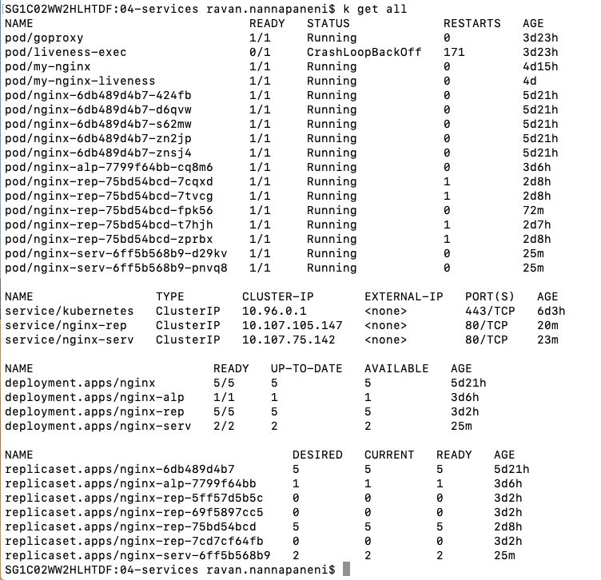
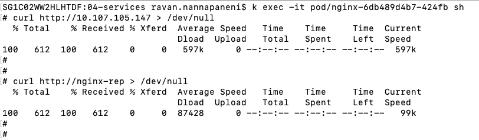
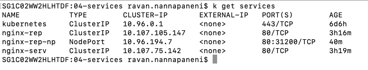
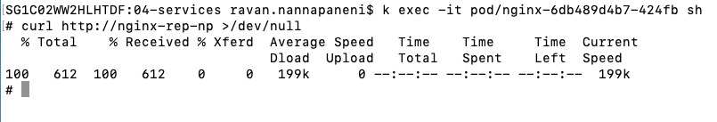
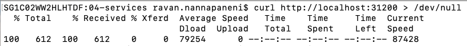
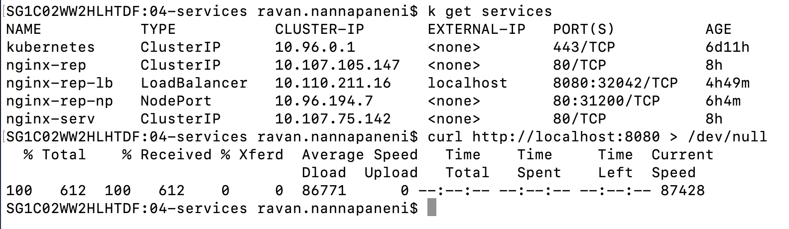

# SERVICES

## TYPES OF SERVICES

- ClusterIP: Exposes the Service on a cluster-internal IP. Choosing this value makes the Service only reachable from within the cluster. This is the default ServiceType.
- NodePort: Exposes the Service on each Node's IP at a static port (the NodePort). A ClusterIP Service, to which the NodePort Service routes, is automatically created. You'll be able to contact the NodePort Service, from outside the cluster, by requesting <NodeIP>:<NodePort>.
- LoadBalancer: Exposes the Service externally using a cloud provider's load balancer. NodePort and ClusterIP Services, to which the external load balancer routes, are automatically created.
- ExternalName: Maps the Service to the contents of the externalName field (e.g. foo.bar.example.com), by returning a CNAME record

### ClusterIP

Refer to the below sample nginx-serv deployment and service files.

[nginx-serv-d YAML](04-services/nginx-serv-d.yaml)

[nginx-serv-s YAML](04-services/nginx-serv-s.yaml)

The below service file is used to create network for nginx-rep file that was worked in deployments section.

[nginx-rep-s YAML](04-services/nginx-rep-s_cip.yaml)

```bash
kubectl apply -f nginx-rep-s_cip.yaml
```

Notice, the selector is a run label as the label defined in the deployment is run.

#### Testing ClusterIP

Before we start to test, lets look at things running on my kubernetes cluster.



Now connect to a random pod running on the same namespace ( not sure at this point if namespace makes a difference)



Both the service name and IP Address are recognized by the node!!!

ClusterIP doesnt expose the service outside Kubernetes. To do this we need to either

1. proxy
2. port forward

### Node Port

Simply put, **Node Port** = ClusterIP + Port Forwarding in one. Node port for nginx-rep service:

[nginx-rep nodeport YAML](04-services/nginx-rep-s_np.yaml)

```bash
kubectl apply -f nginx-rep-s_np.yaml
```

#### Testing NodePort

List of all services running on cluster



Connecting to the service from a pod ( similar to how we did using ClusterIP)



Connecting to the service from host



### Load Balancer

To understand NodePort vs. LoadBalancer refer to the article below:

https://www.ovh.com/blog/getting-external-traffic-into-kubernetes-clusterip-nodeport-loadbalancer-and-ingress/

Load Balancer configuration for nginx-rep deployment:

[LoadBalancer for nginx-rep](04-services/nginx-rep-s_lb.yaml)

### Test Load Balancer

Below image shows the servers on kubernetes and curl response.


